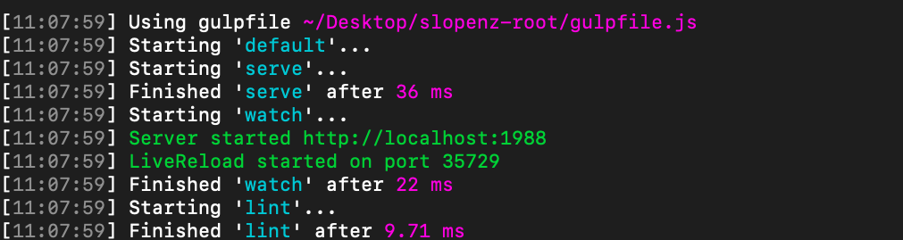
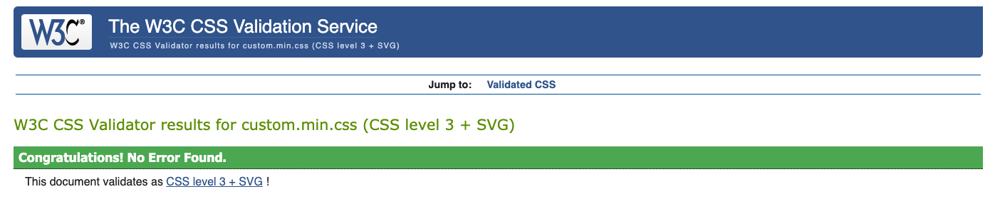
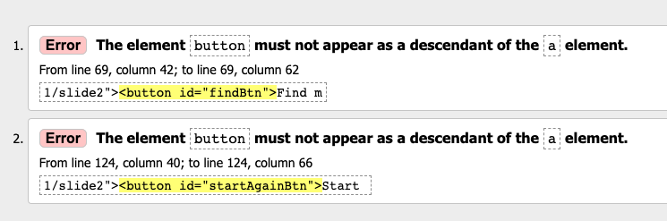

<p align="center">

</p>
<br>

# SLOPE NZ
### Accomodation Finder by Ciaran Slow

An accomodation finder for finding accomodation near NZ Ski Fields.

The project is a Summative Web Dev project for Yoobee Colleges Wellington.

This project uses HTML, CSS and JS. It makes uses of multiple JS Plugins & Libraries.


<br>
<br>

## PROBLEM:

Due to COVID-19 tourism to Queenstown and Wanaka has significantly reduced, impacting local business operators majorly. Both of these regions rely heavily on tourism as their primary industries.  

To try to minimize the ongoing impact Tourism NZ has decided to launch a campaign targeting the upcoming ski season as a way to attract more business for the region from both local and international tourists.

<br>
<br>


## SOLUTION:

Development of a showcase website that allows users useful booking information for the upcoming ski season. The site will include detailed interactive maps to help with locating accommodation, ski fields and nearby bars which meet the Qualmark standard. The site will make effective use of both Tourism NZ and Qualmark branding or imagery to showcase the ski fields/accommodation of the region.

The accommodation finder will allow user to search for accommodation based on:
Ski field selection - show results close by
Number of Guests
Number of Nights

<br>
<br>


## LIBRARIES & PLUGINS:


### * JQuery

Predominantly used for function calls and on-click events. Please see custom.js line #535 full full on click code

```javascript
$('#submitBtn').click(function() {

};
```

### * Bootstraps <https://getbootstrap.com/>

Used for form and card design

```html

<!-- BOOTSRAPS FORM BEGINS -->
            <div class="form-cont" id="parent" data-parsley-validate>
              <div id="searchForm">
                <div class="form-group">
                  <label for="nameInput">Your Name:</label>
                  <input type="text" class="form-control" id="nameInput" data-parsley-required-message="Please enter your name" data-parsley-pattern="^[a-zA-Z ]+$" placeholder="Max 10 char." data-parsley-required="true" maxlength="10">
                </div>
                <div class="form-group">
                  <label for="skifieldInput">Select Your Skifield:</label>
                  <select class="form-control" id="skifieldInput" data-parsley-required="true"  data-parsley-min="1" data-parsley-required-message="Please select Ski Field">
                    <option value="">Choose...</option>
                    <option value="1">Cardrona</option>
                    <option value="2">Treble Cone</option>
                    <option value="3">The Remarkables</option>
                  </select>
                </div>
                <div class="form-group">
                  <label for="nameInput">Number of Nights</label>
                  <input type="text" class="form-control" id="nightInput" placeholder="Max of 15 nights" data-parsley-required-message="Please enter number of nights you wish to stay" data-parsley-required="true" data-parsley-type="number"
                    data-parsley-max="15">
                </div>
                <div class="form-group">
                  <label for="nameInput">Number of Guests</label>
                  <input type="text" class="form-control" id="guestInput" placeholder="Max of 4" data-parsley-required-message="Please enter number of guests" data-parsley-required="true" data-parsley-type="number" data-parsley-max="4">
                </div>
                <button id="submitBtn">See available rooms!</button>
              </div>
            </div>
            <!-- BOOTSRAPS FORM ENDS -->
```


### * Slick JS <https://kenwheeler.github.io/slick/>

Used for output carousel

```javascript
  $('.outputRight').slick({
    arrows: true,
    dots: true,
    slidesToShow: 3,
    slidesToScroll: 3,
		infinite: false
  });
```


### * Parsley JS <https://parsleyjs.org/>

Used for Input Validation on search form

```javascript
var form = $('#parent').parsley();
  $('#parent').find('#submitBtn').click(function() {
    form.validate();
  });

  form.subscribe('parsley:form:success', function(e) {
    $.fn.fullpage.moveSlideRight();
  });
  ```


### * Textillate JS <https://textillate.js.org/>

Used to animate home-screen Title and subtitle

```javascript
function doText () {
    $('.tlt').textillate({
      in: {
        effect: 'fadeInLeft',
        sync: true,
        delay: 1750
      }
    });
  }

  doText();
  ```


### * Fullpage JS <https://alvarotrigo.com/fullPage/>

Used to enable Single Page Application sideways scroll

```javascript
  $('#fullpage').fullpage({
    css3: true,
    verticalCentered: true,
    resize: true,
    sectionSelector: '.section',
    slideSelector: '.slide'
  });

  $.fn.fullpage.setAllowScrolling(false);
```


### Font Awesome v4.0 <https://fontawesome.com/v4.7/>

Used for all card icons - Free Wifi, Family Friendly and Disabled Access.


### * Mapbox <https://www.mapbox.com/>

Used for interactive maps on both the output and ski field screens. Here is a fly to example:

```javascript
function viewOnMapRemarkHouse () {
    map2.flyTo({
      center: [
        168.73088242104754, -45.02902556915285
      ],
      zoom: 15,
      essential: true
    });
    var el = document.createElement('div');
    el.className = 'marker';

    new mapboxgl.Marker(el)
      .setLngLat([168.73088242104754, -45.02902556915285])
      .addTo(map2);
  }
  ```


### * Gulp <https://gulpjs.com/>

Used for JS linting, Sass and live server.

<p align="center">

</p>


### * Node JS <https://nodejs.org/>

Used to install and run Gulp.

<br>

<br>


## PRODUCTION TOOLS USED:

### * Atom Editor

Used to write and edit all code.

### * Terminal

Used for running Node, Gulp and GitHub commits.

### * Adobe Illustrator

Used to create logos and required graphic assets.

### * Adobe XD

Used to create Wireframes, Concepts and Hifi.

### * Google Chrome Browser

Inspect and Console used for in browser design. Network used to manage load times

### * BIRME - website <https://www.birme.net/>

Used for batch image resizing and cropping for card images

### * LucidChart - website <https://www.lucidchart.com/>

Used for creating user flow diagrams

<br>

<br>

## JAVASCRIPT STYLE GUIDE - Idiomatic <https://github.com/rwaldron/idiomatic.js/>

All JS has been written to conform to the Idiomatic JS style guide. 

Areas of the Idiomatic guide include:
<br>

### Use of Whitespace: 

This is to increase readibility. This especially important when declaring conditionals.

Example of this in my code: (Note whitespace between the two plugin functions and comments)

```javascript

// --------------------- PLUGINS BEGIN --------------------

// Fullpage Begins:

  $('#fullpage').fullpage({
    css3: true,
    verticalCentered: true,
    resize: true,
    sectionSelector: '.section',
    slideSelector: '.slide'
  });

  $.fn.fullpage.setAllowScrolling(false);

  // Textillate Begins:
  function doText () {
    $('.tlt').textillate({
      in: {
        effect: 'fadeInLeft',
        sync: true,
        delay: 7000
      }
    });
  }

```

### Consistency: 

This is also to increase readibility. Choosing single or double quotes doesnt matter but you must stick to one.

### Naming: 

This is extremely important for consistency. Use thougful and kind names in camelCase which allow readers to know their meaning.

An example in my cide:

```javascript

$('#submitBtn').click(function() {

    // Input Variables
    var skifeildInput = document.getElementById('skifieldInput');
    var getNightInput = document.getElementById('nightInput');
    var nightInput = parseInt(getNightInput.value);
    var getGuestInput = document.getElementById('guestInput');
    var guestInput = parseInt(getGuestInput.value);

    // Get Card Elements:

    // Images
    var accomImage = document.getElementById('accomImage');
    var accomImage2 = document.getElementById('accomImage2');
    var accomImage3 = document.getElementById('accomImage3');
    var accomImage4 = document.getElementById('accomImage4');
    var accomImage5 = document.getElementById('accomImage5');
    var accomImage6 = document.getElementById('accomImage6');

```
### Comments: 

Must be single line above the code. No end of line comments. Multi line is good.

Example of my implementation:

```javascript
// ---------------- CONDITIONALS -----------------
    // ** Conditionals are organized into sections based on location **

		// *** SKI FIELD INPUT VALUES:
		// 1 = Cardrona
		// 2 = Treble Cone
		// 3 = The Remarkables

    // ----Treble Cone:------

    // Hostel & Hotel

    if ((skifeildInput.value == '2') && (getGuestInput.value == 1) && (getNightInput.value <= 1)) {

      // Change Image
      accomImage.src = 'img/card-images/treb-hostel-1.jpg';
      accomImage2.src = 'img/card-images/treb-hostel-2.jpg';
      accomImage3.src = 'img/card-images/treb-hotel-1.jpg';
      accomImage4.src = 'img/card-images/treb-hotel-2.jpg';
      accomImage5.src = 'img/card-images/treb-hotel-3.jpg';
      accomImage6.src = 'img/card-images/treb-hotel-4.jpg';
  ```


<br>
<br>

## VALIDATION - HTML/CSS AND JS


### CSS:
https://jigsaw.w3.org/css-validator/validator.html.en
<p align="center">

</p>
<br>

### HTML:
<htps://validator.w3.org/>
<p align="center">

</p>
Errors in HTML are due to button being a descendat of an anchor tag. This is required in order to enable the entire button to be clicked and link to work.

### JS:
JS linted via gulp. No errors in lint or console.
<p align="center">

</p>
<br>


